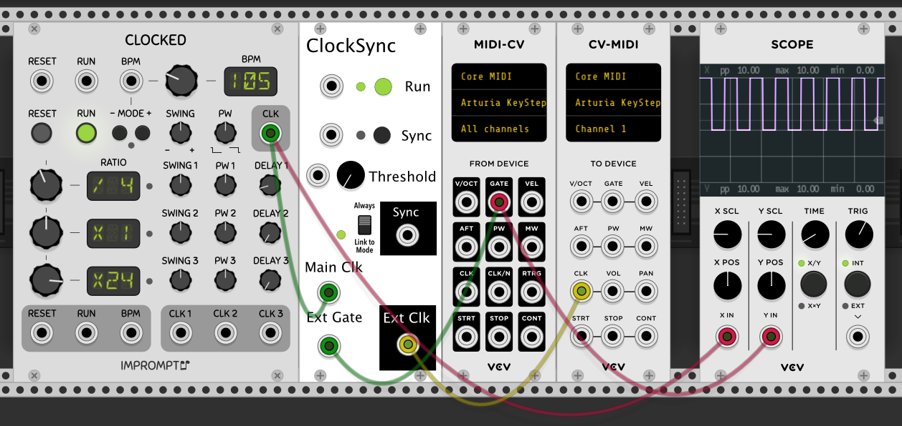

# Megamis Modules

Modules* for [VCV Rack](https://github.com/VCVRack/Rack).
(*Proleptic plural; only one right now.)

**NB**: Still under development; please do not attempt to use in a live performance situation!

## Clock Sync

The Clock Sync module is a utility module for synchronizing VCV Rack clocks with external devices. While it's **not**
able to overcome the inherent latency involved in sending signals through audio and MIDI interfaces to synchronize start
and stop signals, it can align an external clock so that external beat gates arrive at the same time as internal clock.

### Basic Usage

The following instructions are specifically for synchronizing an [Arturia](https://www.arturia.com/) [Keystep](https://www.arturia.com/products/keystep/overview), but the basic
principle should work with other devices.

1. Make sure the Keystep's Sync DIP switches are set appropriately for your setup (e.g. USB, MIDI, or Sync In)
1. In VCV Rack, connect your main clock, ClockSync, MIDI-CV, and CV-MIDI as shown.
1. Switch the Keystep to Arpeggiator and set the Time Division knob to 1/4 notes.
1. Press Play on the keystep and hold down one or more notes or enable the Hold button and press one or more notes.
1. Activate Run on ClockSync so that the clock signal will be sent to the Keystep.
1. Activate Sync on ClockSync to get the beats to line up.
1. Once the LED to the left of the Always/Link to Mode switch illuminates green, the Keystep's
   beats and the main clock's beats are in sync, and the Sync button on ClockSync can be disabled.
1. After disabling the Sync button, you can use your Keystep as usual, including switching to different
   time divisions.

*Notes*: If the level of jitter in your system is too high, the default threshold may not allow
         stable synchronization. Slowly increase the threshold knob until you find a balance
         between a stable clock and satisfactory alignment.

### Example Use Cases

**TODO**

### Theory of Operation

**TODO**

### Verified Working

ClockSync has been tested with the following main clock sources:
* [Impromptu](https://library.vcvrack.com/?brand=Impromptu) [Clocked](https://library.vcvrack.com/ImpromptuModular/Clocked)
* [ZZC](https://library.vcvrack.com/?query=&brand=ZZC) [Clock](https://library.vcvrack.com/ZZC/Clock)
* [Fundamental](https://library.vcvrack.com/Fundamental) [LFO-1](https://library.vcvrack.com/Fundamental/LFO)
* [Bidoo](https://library.vcvrack.com/?query=&brand=Bidoo) [tOCAnTe](https://library.vcvrack.com/Bidoo/tOCAnTe)
* [Stellare](https://library.vcvrack.com/?query=&brand=Stellare+Modular) [Modular Link v2](https://library.vcvrack.com/StellareModular-Link/Link2) ([Ableton Link](https://www.ableton.com/en/link/))

ClockSync has been tested with the following external devices (**NB**: the "external device" can
also be another VCV module):
* [Arturia](https://www.arturia.com/) [Keystep](https://www.arturia.com/products/keystep/overview)
* [Novation](https://novationmusic.com/) [Circuit Tracks](https://novationmusic.com/circuit/circuit-tracks)
* [Impromptu](https://library.vcvrack.com/?brand=Impromptu) [GateSeq64](https://library.vcvrack.com/ImpromptuModular/Gate-Seq-64)

### Known Limitations

* The maximum clock BPM for the main clock is 250bpm. This is because external MIDI devices seem to require a minimum of
  5ms pulses with a maximum duty cycle of 50%. At 250bpm, there will be 100 pulses per second, which leaves 10ms for
  each pulse.
